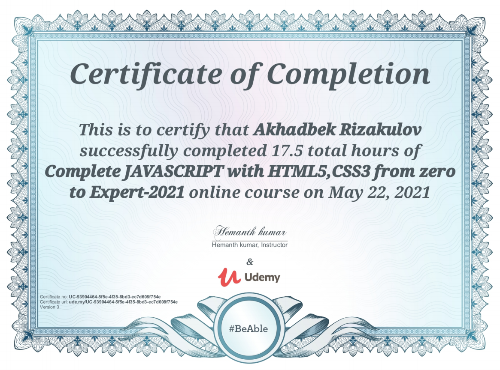
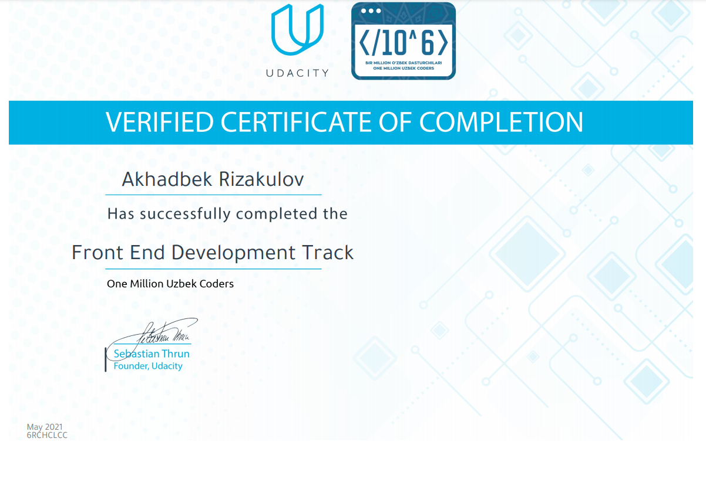
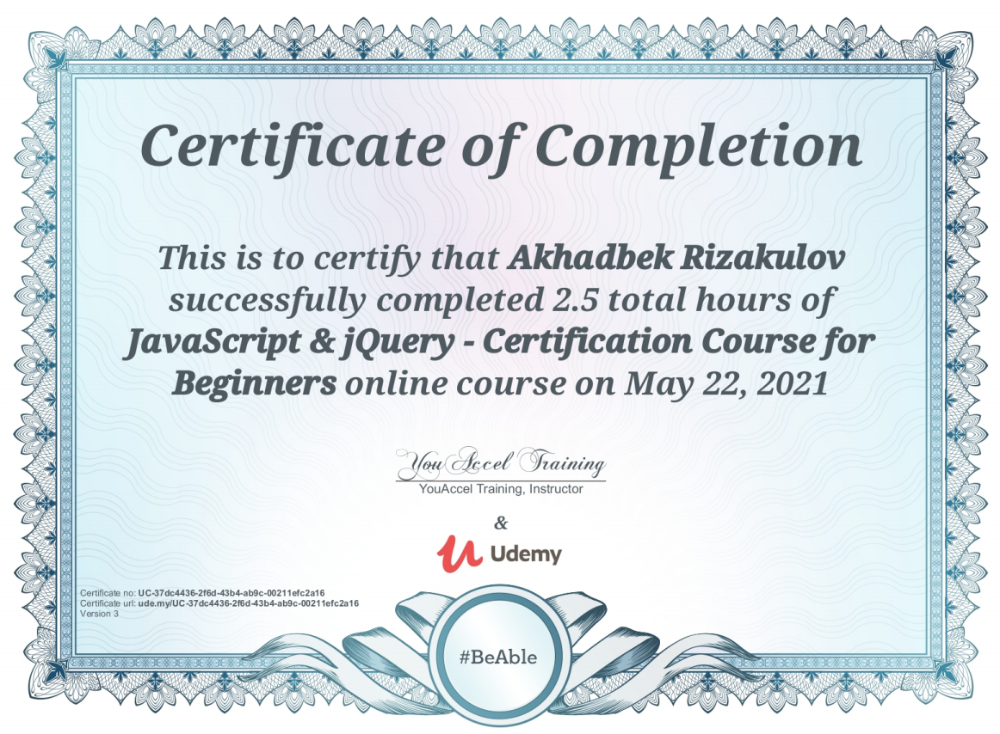
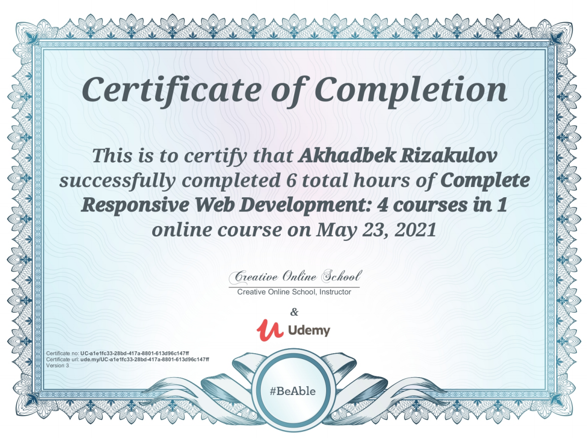
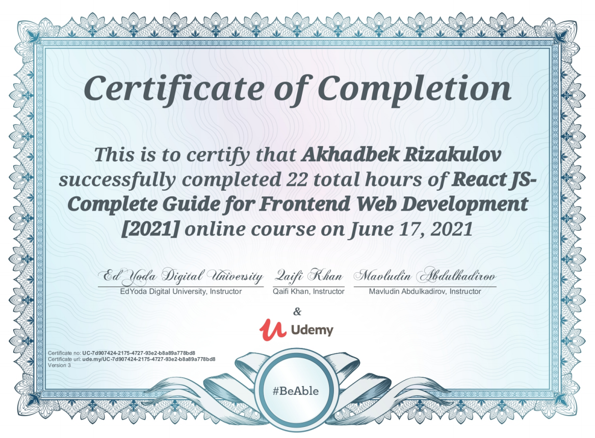
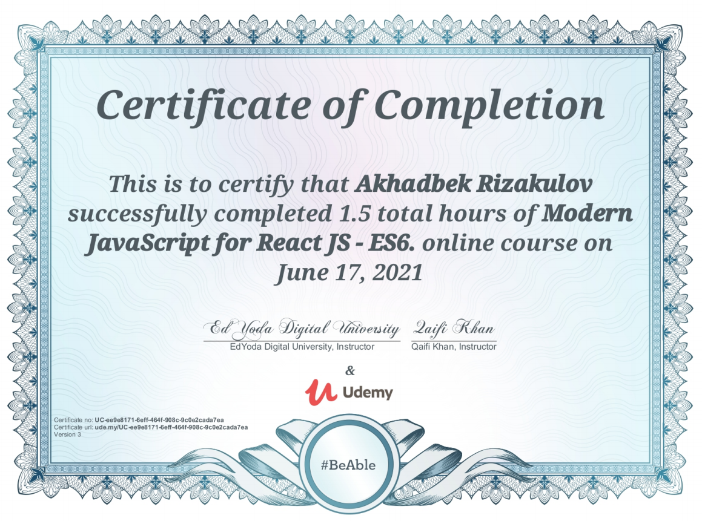
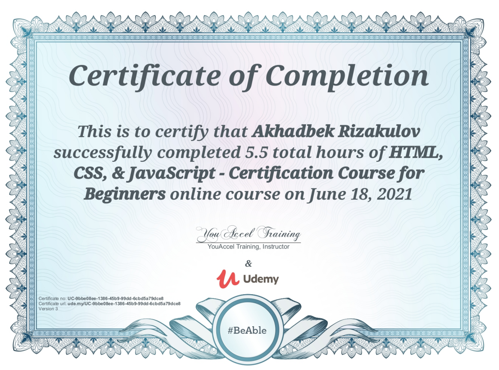
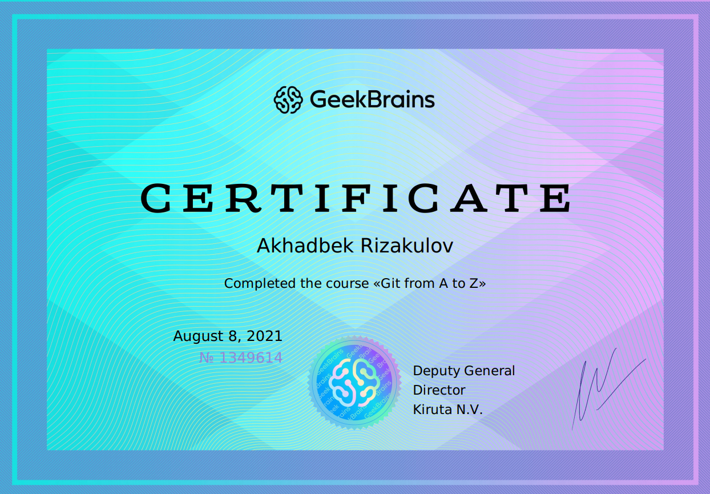
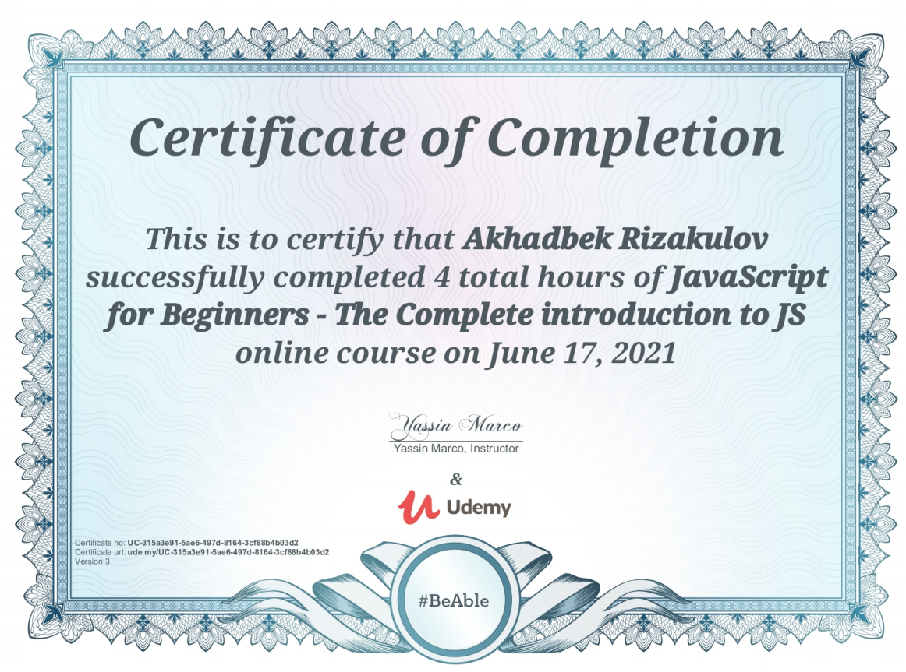

## rsschool-cv
# Junior Front-End Developer

## Personal Info

* Name: Akhadbek
* Surname: Rizakulov
* Date of Birth: 02.08.2002

## Contacts

* Phone: +998 (93) 391-4-391
* Email: abdulaxadrizakulov@gmail.com
* [Telegram](https://t.me/SpeedyM_282)
* [LinkedIn](https://www.linkedin.com/in/abdulakhad-rizakulov-181a50210)

## About Myself

*I am Sophomore at INHA University in Tashkent and now learning Front-End Developemt to start my career in IT sphere.\
I started learning Front-End Development in August of 2020 and already made some mini-projects using HTML, CSS and JavaScript.\
Also, in university I have learned C++ (OOP) and made about 15 mini-projects.\
All my projects you can find in my GitHub page.*

## Skills

* C++ (OOP)
* HTML
* CSS
* JavaScript
* Git, GitHub
* VS Code

## My code Examples

***JavaScript Code Example***
```
function changeMode(){
  if(document.getElementById('onOff').checked == true){
    document.getElementById('body-part').style.backgroundColor = "rgb(59, 59, 59)";
    alert("Dark Mode");
  }
  else{
    document.getElementById('body-part').style.backgroundColor = "aliceblue";
    alert("Light Mode");
  }
}
```

***C++ Code Example***

```
patient_set_menu();					
new_file.open("Patient.txt", std::ios::in);

std::cout << "\n  First Name: "; std::cin >> first_name;
new_file >> first_name;

std::cout << "\n  Last Name: "; std::cin >> last_name;
new_file >> last_name;

std::cout << "\n  Gender [F/M]: "; std::cin >> gender;
new_file >> gender;

std::cout << "\n  Age: "; std::cin >> age; std::cin.ignore();
new_file >> age;

std::cout << "\n  Address: "; std::getline(std::cin, address);
new_file >> address;

std::cout << "\n  Contact no: "; std::cin >> phone;
new_file >> phone;

std::cout << "\n  Email: "; std::cin >> email; std::cin.ignore();
new_file >> email;

std::cout << "\n  Problem: "; std::getline(std::cin, problem);
new_file >> problem;

std::cout << "\n  ID Number: "; std::cin >> id_num; std::cin.ignore();
new_file >> id_num;

std::cout << "\n  Prescribed Doctor: "; std::getline(std::cin, prescr_doctor);
new_file >> prescr_doctor;

any_key(key);	

patient1.set_firstName(first_name);
patient1.set_lastName(last_name);
patient1.set_idNum(id_num);
patient1.set_gender(gender);
patient1.set_age(age);
patient1.set_address(address);
patient1.set_phone(phone);
patient1.set_email(email);
patient1.set_problem(problem);
patient1.set_prescrDoctor(prescr_doctor);
```

## Passed Courses

1. *Online Digital Camp - Front-End Development Track* - Digital Generation Uzbakistan (August 2020)
2. *Front-End Development Track* - Udacity (May 2021)
3. *HTML, CSS, JavaScript from zero to expert* - Udemy (May 2021)
4. *JavaScript & jQuery for Beginners* - Udemy (May 2021)
5. *Complete Responsive Web Development* - Udemy (May 2021)
6. *ReactJS for Front-End* - Udemy (June 2021)
7. *JavaScript for ReactJS* - Udemy (June 2021)
8. *HTML, CSS, JavaScript for Beginners* - Udemy (June 2021)
9. *JavaScript for Beginners* - Udemy (June 2021)
10. *Git from A to Z* - GeekBrains (August 2021)


## Certificates

    
    
    

## Languages

* Uzbek - Native
* Russian - C1
* English - B1

